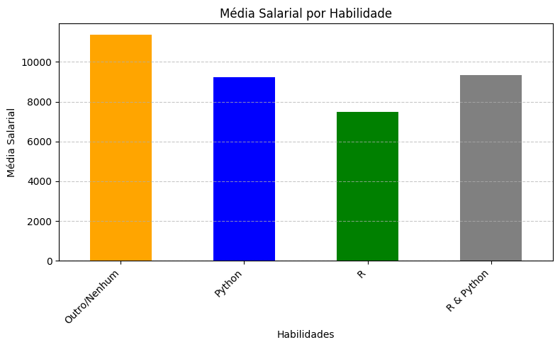
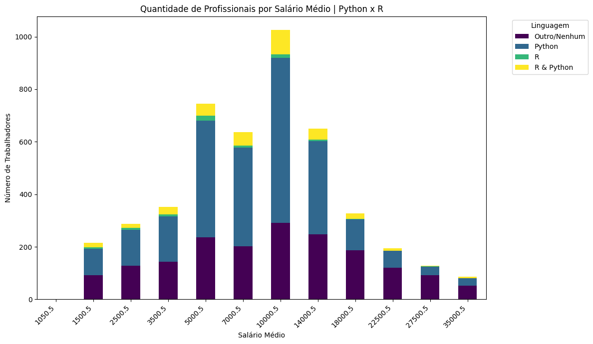

# Os fatores que influenciam os salários dos profissionais de dados no Brasil.

INTEGRANTES:

Antonio Augusto Vieira Lopes Filho, aavlfilho@sga.pucminas.br

Daniel Pires de Andrade Boller, daniel.boller@sga.pucminas.br

Diego Rodrigo Marinho Silva, diego.marinho@sga.pucminas.br

Ryan Junio de Oliveira, ryan.junio@sga.pucminas.br

Vinicius Bigonha Cancela Moraes de Melo Filho, vbcmmfilho@sga.pucminas.br  

---

Professores:

Prof. Hugo Bastos de Paula

Prof. Hayala Nepomuceno Curto

---

_Curso de Ciência de Dados, Unidade Praça da Liberdade_

_Instituto de Informática e Ciências Exatas – Pontifícia Universidade de Minas Gerais (PUC MINAS), Belo Horizonte – MG – Brasil_

---

**Resumo**. Este projeto propõe o desenvolvimento de um sistema inteligente para analisar como fatores como nível de formação, experiência profissional, porte da empresa, região de residência e domínio de tecnologias específicas influenciam os salários dos profissionais de dados no Brasil. Utilizando técnicas de aprendizado de máquina e análise estatística, o sistema processará dados de diversas fontes para identificar padrões e correlações entre essas variáveis e a remuneração. O objetivo é fornecer insights precisos que auxiliem profissionais e empresas a entenderem melhor os fatores que impactam os salários no setor de dados, contribuindo para decisões estratégicas de carreira e gestão de talentos. 

---

## Introdução

O mercado de dados no Brasil está em constante expansão, e diversos fatores influenciam a remuneração dos profissionais da área. Aspectos como nível de formação, experiência profissional, porte da empresa, localização geográfica e domínio de determinadas tecnologias podem impactar significativamente os salários. Compreender essas variáveis é essencial tanto para profissionais que buscam crescimento na carreira quanto para empresas que desejam atrair e reter talentos. Neste contexto, este projeto propõe o desenvolvimento de um sistema inteligente capaz de analisar e identificar padrões salariais no setor de dados, auxiliando na tomada de decisões estratégicas.

###    Contextualização

Nos últimos anos, a área de ciência de dados tem se consolidado como um dos segmentos mais promissores do mercado de trabalho, impulsionada pelo crescimento da transformação digital e pelo uso intensivo de dados nas tomadas de decisão empresariais. Com essa expansão, há um aumento na demanda por profissionais qualificados, o que torna relevante a análise dos fatores que influenciam a remuneração desses especialistas.
Nesse contexto, este projeto se insere na interseção entre inteligência artificial, análise de dados e mercado de trabalho, buscando compreender como diferentes características dos profissionais de dados impactam seus salários no Brasil. Para isso, o estudo utiliza um sistema inteligente capaz de processar grandes volumes de informações e identificar padrões relacionados a variáveis como nível de formação, experiência profissional, porte da empresa, localização geográfica e domínio de tecnologias específicas. Essa abordagem possibilita uma análise mais precisa e baseada em evidências sobre os determinantes salariais no setor.

###    Problema

O problema central deste projeto é entender quais características dos profissionais de dados no Brasil afetam de forma mais significativa seus salários. Essa questão é relevante tanto para trabalhadores que buscam otimizar suas trajetórias profissionais quanto para empresas que desejam estabelecer políticas salariais mais competitivas. O contexto da aplicação envolve o mercado de tecnologia e ciência de dados, abrangendo profissionais de diferentes perfis, desde iniciantes até especialistas, que atuam em empresas de diversos portes e segmentos. O estudo se baseia em dados reais, extraídos de fontes como o State of Data - BR 2023, para analisar padrões e tendências salariais no setor. 

###    Objetivo geral

Desenvolver um sistema inteligente para analisar o impacto de fatores como nível de formação, experiência profissional, porte da empresa, localização geográfica e conhecimento em tecnologias nos salários dos profissionais de dados no Brasil, utilizando dados extraídos do State of Data - BR 2023 e outras fontes complementares. 

####    Objetivos específicos

Analisar a relação entre nível de formação, experiência profissional e porte da empresa com a remuneração dos profissionais de dados no Brasil, utilizando técnicas de aprendizado de máquina e análise estatística.

Investigar o impacto da localização geográfica e do domínio de determinadas tecnologias no salário dos profissionais, identificando possíveis desigualdades regionais e valorização de habilidades específicas no mercado.

Desenvolver modelos preditivos capazes de estimar faixas salariais com base nos atributos dos profissionais, fornecendo insights para tomada de decisão sobre carreira e políticas salariais.

Implementar visualizações interativas e relatórios analíticos para facilitar a interpretação dos padrões identificados, tornando os resultados acessíveis para diferentes perfis de usuários.

###    Justificativas

A crescente demanda por profissionais de ciência de dados no Brasil, aliada às variações salariais influenciadas por múltiplos fatores, torna essencial a compreensão dos elementos que impactam a remuneração desses especialistas. Segundo o artigo "Carreira em Dados: conheça as principais áreas e como ingressar" (Alura, 2023), aspectos como nível de formação, experiência, porte da empresa, localização geográfica e domínio de tecnologias exercem influência direta sobre as oportunidades e os ganhos no setor. No entanto, ainda há uma lacuna na identificação quantitativa e preditiva desses fatores, dificultando a tomada de decisão tanto para profissionais que buscam progressão na carreira quanto para empresas que desejam formular políticas salariais competitivas.
Diante desse cenário, este projeto se justifica pela necessidade de um sistema inteligente capaz de analisar e prever os impactos desses fatores nos salários dos profissionais de dados no Brasil. Ao utilizar dados extraídos do State of Data - BR 2023 e outras fontes complementares, o sistema busca gerar insights estratégicos baseados em evidências, permitindo um entendimento mais profundo da valorização profissional no setor. Além disso, a implementação de modelos preditivos e visualizações interativas possibilita a democratização da informação, fornecendo subsídios para que profissionais façam escolhas informadas sobre suas carreiras e empresas ajustem suas políticas de remuneração de forma mais eficiente e equitativa.

##    Público alvo

A aplicação será utilizada por diferentes perfis de usuários que buscam compreender os fatores que influenciam os salários no setor de ciência de dados no Brasil. Esses usuários podem ter níveis variados de conhecimento sobre tecnologia e estatística, mas todos compartilham o interesse em tomar decisões informadas com base em dados. A seguir, são descritos os principais perfis de usuários:

**Profissionais de Ciência de Dados e Tecnologia**
**Perfil:** Engenheiros de dados, cientistas de dados, analistas de dados e desenvolvedores que desejam entender melhor o impacto de fatores como experiência, formação acadêmica e habilidades tecnológicas em seus salários. 
**Conhecimento prévio:** Alto conhecimento técnico em programação, estatística e machine learning. Familiaridade com análise de dados e interpretação de gráficos interativos. 
**Relação com a tecnologia:** Usuários experientes, que podem usar os resultados do sistema para planejar sua progressão de carreira e negociar salários. 

**Profissionais em Transição de Carreira**
**Perfil:** Pessoas migrando para a área de dados, vindas de setores como engenharia, administração, marketing e finanças. 
**Conhecimento prévio:** Nível intermediário a básico em ciência de dados e estatística. Interesse em entender quais habilidades e qualificações são mais valorizadas no mercado. 
**Relação com a tecnologia:** Familiarizados com ferramentas básicas de análise de dados, mas podem necessitar de suporte na interpretação dos resultados. 

**Recrutadores e Gestores de RH**
**Perfil:** Profissionais de Recursos Humanos e gestores que contratam e definem políticas salariais para equipes de dados. 
**Conhecimento prévio:** Baixo conhecimento técnico sobre ciência de dados, mas familiaridade com tendências de mercado e estruturação de cargos e salários. 
**Relação com a tecnologia:** Usam a aplicação para comparar remunerações, identificar padrões e embasar decisões estratégicas de contratação. 

**Empresas e Tomadores de Decisão**
**Perfil:** Diretores e líderes de empresas de tecnologia e dados que desejam entender melhor a dinâmica salarial do setor para definir estratégias de retenção e contratação. 
**Conhecimento prévio:** Alto conhecimento sobre negócios e gestão, mas limitado em análise de dados e machine learning. 
**Relação com a tecnologia:** Buscam relatórios e insights claros para embasar decisões estratégicas. 

## Análise exploratórida dos dados

###    Dicionário de dados

**State of Data Brazil 2023**
A base de dados State of Data Brazil 2023 é rica em informações sobre profissionais no setor de dados no Brasil, abordando tanto características demográficas quanto aspectos profissionais e de experiência no mercado de trabalho.
 
# Dicionário de Dados

| Variável                                | Descrição                                                                 | Tipo de Dado                            |
|-----------------------------------------|---------------------------------------------------------------------------|-----------------------------------------|
| Salario Médio                           | Média da faixa salarial mensal                                            | Quantitativo - Contínuo                 |
| Nível                                   | Nível de carreira (experiência, autonomia, responsabilidades)             | Qualitativo - Ordinal                   |
| Número de Funcionários da Empresa       | Faixa do número de funcionários da empresa                                | Qualitativo - Ordinal                   |
| Situação Atual de Trabalho              | Tipo de vínculo empregatício                                              | Qualitativo - Nominal - Multivariado    |
| Área de Formação                        | Área acadêmica do profissional                                            | Qualitativo - Nominal - Multivariado    |
| Estado de Origem                        | Estado originário do profissional                                         | Qualitativo - Nominal - Multivariado    |
| Mudou de Estado                         | Se mudou de estado                                                        | Qualitativo - Nominal - Binário         |
| PCD (Pessoa Com Deficiência)            | Se possui alguma deficiência                                              | Qualitativo - Nominal - Binário         |
| Estado onde Mora                        | Estado de residência atual                                                | Qualitativo - Nominal - Multivariado    |
| UF onde Mora                            | Unidade Federativa da residência atual                                    | Qualitativo - Nominal - Multivariado    |
| Região onde Mora                        | Região do Brasil onde reside                                              | Qualitativo - Nominal - Multivariado    |
| Idade                                   | Idade em anos                                                             | Quantitativo - Discreto                 |
| Faixa de Idade                          | Faixa etária (ex: 22-24, 30-34)                                           | Qualitativo - Ordinal                   |
| Gênero                                  | Gênero (Masculino, Feminino, etc.)                                        | Qualitativo - Nominal - Binário         |
| Etnia/Cor/Raça                          | Etnia, cor ou raça do profissional                                        | Qualitativo - Nominal - Multivalorado   |
| Nível de Ensino                         | Nível de escolaridade                                                     | Qualitativo - Ordinal                   |
| Faixa Salarial Mensal                   | Intervalo de renda mensal                                                 | Qualitativo - Ordinal                   |
| Experiência Profissional em Dados       | Tempo de experiência em dados                                             | Qualitativo - Ordinal                   |
| Cargo Atual                             | Cargo ocupado atualmente                                                  | Qualitativo - Nominal - Multivariado    |
| Tamanho da Empresa                      | Porte da empresa                                                          | Qualitativo - Ordinal                   |
| Modelo de Trabalho                      | Regime de trabalho                                                        | Qualitativo - Nominal - Multivariado    |
| Setor da Empresa                        | Setor de atuação                                                          | Qualitativo - Nominal - Multivariado    |

## Cargos (Binários)

| Variável                                | Descrição                              | Tipo de Dado                       |
|-----------------------------------------|----------------------------------------|------------------------------------|
| Analytics_Engineer                      | Cargo                                  | Qualitativo - Nominal - Binário    |
| Data_Engineer                           | Cargo                                  | Qualitativo - Nominal - Binário    |
| Data_Analyst                            | Cargo                                  | Qualitativo - Nominal - Binário    |
| Data_Scientist                          | Cargo                                  | Qualitativo - Nominal - Binário    |
| Database_Administrator                  | Cargo                                  | Qualitativo - Nominal - Binário    |
| Analista_de_Bussiness_Intelligence      | Cargo                                  | Qualitativo - Nominal - Binário    |
| Data_Architect                          | Cargo                                  | Qualitativo - Nominal - Binário    |
| Data_Product_Manager                    | Cargo                                  | Qualitativo - Nominal - Binário    |
| Business_Analyst                        | Cargo                                  | Qualitativo - Nominal - Binário    |

## Linguagens de Programação (Binários)

| Variável                                | Tipo de Dado                       |
|-----------------------------------------|------------------------------------|
| SQL                                     | Qualitativo - Nominal - Binário    |
| R                                       | Qualitativo - Nominal - Binário    |
| Python                                  | Qualitativo - Nominal - Binário    |
| C/C++/C#                                | Qualitativo - Nominal - Binário    |
| .NET                                    | Qualitativo - Nominal - Binário    |
| Java                                    | Qualitativo - Nominal - Binário    |
| Julia                                   | Qualitativo - Nominal - Binário    |
| SAS                                     | Qualitativo - Nominal - Binário    |
| Visual Basic                            | Qualitativo - Nominal - Binário    |
| Scala                                   | Qualitativo - Nominal - Binário    |
| MATLAB                                  | Qualitativo - Nominal - Binário    |
| Rust                                    | Qualitativo - Nominal - Binário    |
| PHP                                     | Qualitativo - Nominal - Binário    |
| JavaScript                              | Qualitativo - Nominal - Binário    |
| Não utilizo nenhuma linguagem           | Qualitativo - Nominal - Binário    |

## Ferramentas - Nuvem e Armazenamento (Binários)

| Variável                                | Tipo de Dado                       |
|-----------------------------------------|------------------------------------|
| Azure (Microsoft)                       | Qualitativo - Nominal - Binário    |
| Amazon Web Services                     | Qualitativo - Nominal - Binário    |
| Google Cloud (GCP)                      | Qualitativo - Nominal - Binário    |
| Oracle Cloud                            | Qualitativo - Nominal - Binário    |
| IBM                                     | Qualitativo - Nominal - Binário    |
| Servidores On Premise                   | Qualitativo - Nominal - Binário    |
| Cloud própria                           | Qualitativo - Nominal - Binário    |

## Ferramentas de BI (Binários)

| Variável                                | Tipo de Dado                       |
|-----------------------------------------|------------------------------------|
| Microsoft Power BI                      | Qualitativo - Nominal - Binário    |
| Qlik View/Qlik Sense                    | Qualitativo - Nominal - Binário    |
| Tableau                                 | Qualitativo - Nominal - Binário    |
| Metabase                                | Qualitativo - Nominal - Binário    |
| Superset                                | Qualitativo - Nominal - Binário    |
| Redash                                  | Qualitativo - Nominal - Binário    |
| Looker                                  | Qualitativo - Nominal - Binário    |
| Looker Studio (Google Data Studio)      | Qualitativo - Nominal - Binário    |
| Amazon Quicksight                       | Qualitativo - Nominal - Binário    |
| Mode                                    | Qualitativo - Nominal - Binário    |
| Alteryx                                 | Qualitativo - Nominal - Binário    |
| MicroStrategy                           | Qualitativo - Nominal - Binário    |
| IBM Analytics/Cognos                    | Qualitativo - Nominal - Binário    |
| SAP Business Objects/SAP Analytics      | Qualitativo - Nominal - Binário    |
| Oracle Business Intelligence            | Qualitativo - Nominal - Binário    |
| Salesforce/Einstein Analytics           | Qualitativo - Nominal - Binário    |
| Birst                                   | Qualitativo - Nominal - Binário    |
| SAS Visual Analytics                    | Qualitativo - Nominal - Binário    |
| Grafana                                 | Qualitativo - Nominal - Binário    |
| TIBCO Spotfire                          | Qualitativo - Nominal - Binário    |
| Pentaho                                 | Qualitativo - Nominal - Binário    |
| Fazemos todas as análises em planilhas  | Qualitativo - Nominal - Binário    |
| Não utilizo nenhuma ferramenta de BI    | Qualitativo - Nominal - Binário    |

Tabela Pib 2021

| Dado | Tipo de Dado | Descrição |
|:-----|:------------|:----------|
| UF | Qualitativo Nominal | Sigla da Unidade da Federação (estados brasileiros e Distrito Federal) - dados não numéricos sem ordem intrínseca |
| PIB_2021_OR | Quantitativo Contínuo | Valor do Produto Interno Bruto em 2021, em milhões de reais (admite valores intermediários, apesar de estar representado como inteiro) |
| Partic_Pib_Brasil | Quantitativo Contínuo | Participação percentual do estado no PIB nacional (valores decimais entre 0 e 1) |

Tabela IDHM 2021

| Dado | Tipo de Dado | Descrição |
|:-----|:------------|:----------|
| Ano | Quantitativo Discreto | Ano de referência dos dados (valores inteiros específicos) |
| Uf | Qualitativo Nominal | Sigla da Unidade da Federação (categorias sem ordem intrínseca) |
| Nome_Estado | Qualitativo Nominal | Nome completo do estado brasileiro ou DF |
| IDHM | Quantitativo Contínuo | Índice de Desenvolvimento Humano Municipal (escala 0-1) |
| IDHM_L | Quantitativo Contínuo | Dimensão Longevidade do IDHM (escala 0-1) |
| IDHM_E | Quantitativo Contínuo | Dimensão Educação do IDHM (escala 0-1) |
| IDHM_R | Quantitativo Contínuo | Dimensão Renda do IDHM (escala 0-1) |
| IDHMAD | Quantitativo Contínuo | IDHM Ajustado à Desigualdade (escala 0-1) |
| IDHMAD_L | Quantitativo Contínuo | Dimensão Longevidade do IDHMAD (escala 0-1) |
| IDHMAD_E | Quantitativo Contínuo | Dimensão Educação do IDHMAD (escala 0-1) |
| IDHMAD_R | Quantitativo Contínuo | Dimensão Renda do IDHMAD (escala 0-1) |
| RDPC | Quantitativo Contínuo | Renda Domiciliar per Capita (em R$) |
| GINI | Quantitativo Contínuo | Índice de Gini (medida de desigualdade 0-1) |
| THEIL | Quantitativo Contínuo | Índice de Theil (medida de desigualdade ≥0) |

##    Descrição de dados :bar_chart:

### State of Data

A base de dados **State of Data Brazil 2023** retrata o perfil dos profissionais de dados no Brasil, abordando aspectos como formação acadêmica, experiência profissional, faixa salarial, ferramentas utilizadas e desafios enfrentados no setor.

 ### Idade
- **Número de observações não nulas**: 5.293  
- **Média**: 32,0 anos  
- **Desvio padrão**: 7,62  
- **Valor mínimo**: 18 anos  
- **Primeiro quartil (25%)**: 27 anos  
- **Mediana (50%)**: 30 anos  
- **Terceiro quartil (75%)**: 36 anos  
- **Valor máximo**: 73 anos
  

### Sexo ou Gênero
- **Masculino**: 75,1% (3.975 respostas)  
- **Feminino**: 24,4% (1.293 respostas)  
- **Prefiro não informar**: 0,3% (16 respostas)  
- **Outros**: 0,2% (9 respostas)
  

### Raça ou Etnia
- **Branca**: 64,5% (3.414 respostas)  
- **Parda**: 24,2% (1.281 respostas)  
- **Preta**: 7,3% (387 respostas)  
- **Prefiro não informar**: 0,6% (34 respostas)  
- **Outra**: 0,3% (18 respostas)
  

### Nível de Ensino
- **Doutorado ou PhD**: 34,3% (1.818 respostas)  
- **Graduação/Bacharelado**: 34,0% (1.798 respostas)  
- **Estudante de Graduação**: 12,8% (678 respostas)  
- **Pós-graduação**: 12,8% (676 respostas)  
- **Mestrado**: 4,0% (210 respostas)  
- **Não tenho graduação formal**: 2,0% (105 respostas)  
- **Prefiro não informar**: 0,2% (8 respostas)

### Salário Médio (Coluna calculada baseada na coluna faixa salarial da tabela original)
- **Número de observações não nulas**: 4.651  
- **Média**: R$ 10.028,67  
- **Desvio padrão**: R$ 6.969,22  
- **Valor mínimo**: R$ 1.050,50  
- **Primeiro quartil (25%)**: R$ 5.000,50  
- **Mediana (50%)**: R$ 10.000,50  
- **Terceiro quartil (75%)**: R$ 14.000,50  
- **Valor máximo**: R$ 35.000,50
  

### Média salárial por UF

### UF
- **Indica os estados brasileiros onde os profissionais de dados estão localizados**.
  

### Quantidade de profissionais de Dados relacionando Gêneros por Uf

### Distribuição da média salarial por gênero por UF

### Média salarial por Gênero 

### Média salarial por Cor/Raça/Etnia

### Cargo Atual
- **Informa os cargos que os profissionais de dados ocupam**.
  

### Média salarial por Cargo na área de Ciência de Dados

### Média salarial por Ferramenta/Plataforma Utilizada

### Média salarail por linguagem de programação Utilizada

### Média salarial por setores de Atuação

### Número de funcionários da empresa que trabalha
- **Demonstra o número de funcionários da empresa onde o profissional de dados atua**.
  

### Nível
- **Mostra os níveis de experiência dos profissionais de dados (Júnior, Pleno, Sênior)**.
  

### Média salarial por Nivel de experiência.

### Tempo de experiência na área de dados
- **Apresenta o tempo de experiência dos profissionais agrupado por faixas**.
  

## Base Auxiliares

### IDH 2021 por UF
- **O grafico mostra o Indice de Desenvolvimento Humano dividido por Estado**.
  

- **Número de observações não nulas: 27** 
- **Média: 0.730148**
- **Desvio padrão: 0.039892**
- **Valor mínimo: 0.676000** 	
- **Primeiro quartil (25% dos dados estão abaixo deste valor):0.698500**
- **Mediana (segundo quartil, 50% dos dados estão abaixo): 0.728000**
- **Terceiro quartil (75% dos dados estão abaixo deste valor): 0.765500**
- **Valor máximo: R$ 0.814000**
      

### PIB 2021 por UF

- **Número de observações não nulas: 27** 
- **Média: 333.783.100.000,00**
- **Desvio padrão: 535.633.300.000,00**
- **Valor mínimo: 18.203.000.000,00**
- **Primeiro quartil (25% dos dados estão abaixo deste valor): 70.147.000.000,00**
- **Mediana (segundo quartil, 50% dos dados estão abaixo): 186.337.000.000,00**
- **Terceiro quartil (75% dos dados estão abaixo deste valor): 319.781.000.000,00**
- **Valor máximo: R$ 2.719.751.000.000,00**

## Preparação dos dados

### State of Data Brazil 2023

Considerando que o problema central deste projeto é entender quais características dos profissionais de dados no Brasil afetam de forma mais significativa seus salários, foram levantados algumas hipóteses que serão trabalhadas nesse projeto. As hipóteses levantadas são as seguintes:

#### Hipótese 1: Existe uma correlação entra o valor do salário com o PIB e o IHD do estado que o profissional trabalha?
#### Hipótese 2: O setor de atuação e o tamanho da empresa (Número de funcionários) influenciam o salário? Com setores como finanças e grandes empresas oferecendo melhores remunerações?
#### Hipótese 3: A diversidade de linguagens de programação utilizadas e o domínio de tecnologias específicas como cloud e ferramentas de BI estão associados a salários mais altos?
#### Hipótese 4: Existe uma disparidade salarial significativa entre homens e mulheres entre os profissionais de dados, mesmo quando controlamos por fatores como experiência, nível de escolaridade e cargo?
#### Hipótese 5: Nível de formação acadêmica: Profissionais com pós-graduação, mestrado ou doutorado tendem a receber salários mais altos do que aqueles com apenas graduação.

Na tabela State of Data Brazil 2023 foram selecionados os atributos de acordo com o problema e as hipóteses que foram levantada.
Como o problema gira em torno do salário dos profissionais de dados, foram criadas as colunas Salario_minino, Salario_maximo e Salario médio, de acordo com a coluna Faixa Salarial, que já existia na base de dados original.

| Dado | Tipo de dado | Descrição |
|------|--------------|-----------|
| Faixa_Salarial | Qualitativo ordinal | Intervalos salariais em categorias |
| Salario_Minimo | Quantitativo contínuo | Valor mínimo da faixa salarial em R$ |
| Salario_Maximo | Quantitativo contínuo | Valor máximo da faixa salarial em R$ |
| Salario_Medio | Quantitativo contínuo | Valor médio da faixa salarial em R$ |

Para enriquecimento do trabalho e para tentar responder a primeira hipótese (Existe uma correlação entra o valor do salário com o PIB e o IHD do estado que o profissional trabalha?
) foi incluída a base de dados do PIB 2021 (Contas regionais de 2021). Disponível em: https://www.ibge.gov.br/estatisticas/economicas/contas-nacionais/9054-contas-regionais-do-brasil.html?edicao=38346. Os dados são de 2021, pois as informações das contas regionais de 2023 não estão disponíveis. Conforme comunicado no site do IBGE, as informações não foram disponibilizadas, pois está sendo feita a mudança de ano base do Sistema de Contas que passará de 2010 para 2021, conforme divulgado no site do IBGE (https://www.ibge.gov.br/novo-portal-destaques/37997-divulgacao-do-informativo-das-contas-nacionais-anuais.html#:~:text=O%20ano%20base%20do%20Sistema%20de%20Contas,de%20Insumo%2DProduto%20e%20Conta%20Sat%C3%A9lite%20de%20Sa%C3%BAde.). 

Na tabela Pib 2021 serão utilizados os seguintes atributos:

| Dado | Tipo de Dado | Descrição |
|:-----|:------------|:----------|
| UF | Qualitativo Nominal | Sigla da Unidade da Federação (estados brasileiros e Distrito Federal) - dados não numéricos sem ordem intrínseca |
| PIB_2021_OR | Quantitativo Contínuo | Valor do Produto Interno Bruto em 2021, em milhões de reais (admite valores intermediários, apesar de estar representado como inteiro) |
| Partic_Pib_Brasil | Quantitativo Contínuo | Participação percentual do estado no PIB nacional (valores decimais entre 0 e 1) |

Será utilizada os valores do PIB pela ótica da renda. O IBGE usa esta metodologia para calcular o PIB, incluindo remunerações de empregados, rendimento misto, excedente operacional bruto e impostos sobre a produção e importação, líquidos de subsídios.

Outra base de dados que será utilizada é a base de dados sobre O IDH que foi extraída do site do IPEA DATA. Disponíel em: http://www.ipeadata.gov.br/Default.aspx. Os dados são de 2021, pois é a única base de dados de IDH por estado.

Na Tabela IDH 2021 serão utilizados os seguintes atributos: 

| Dado | Tipo de Dado | Descrição |
|:-----|:------------|:----------|
| Ano | Quantitativo Discreto | Ano de referência dos dados (valores inteiros específicos) |
| Uf | Qualitativo Nominal | Sigla da Unidade da Federação (categorias sem ordem intrínseca) |
| Nome_Estado | Qualitativo Nominal | Nome completo do estado brasileiro ou DF |
| IDHM | Quantitativo Contínuo | Índice de Desenvolvimento Humano Municipal (escala 0-1) |
| IDHM_L | Quantitativo Contínuo | Dimensão Longevidade do IDHM (escala 0-1) |
| IDHM_E | Quantitativo Contínuo | Dimensão Educação do IDHM (escala 0-1) |
| IDHM_R | Quantitativo Contínuo | Dimensão Renda do IDHM (escala 0-1) |
| IDHMAD | Quantitativo Contínuo | IDHM Ajustado à Desigualdade (escala 0-1) |
| IDHMAD_L | Quantitativo Contínuo | Dimensão Longevidade do IDHMAD (escala 0-1) |
| IDHMAD_E | Quantitativo Contínuo | Dimensão Educação do IDHMAD (escala 0-1) |
| IDHMAD_R | Quantitativo Contínuo | Dimensão Renda do IDHMAD (escala 0-1) |
| RDPC | Quantitativo Contínuo | Renda Domiciliar per Capita (em R$) |
| GINI | Quantitativo Contínuo | Índice de Gini (medida de desigualdade 0-1) |
| THEIL | Quantitativo Contínuo | Índice de Theil (medida de desigualdade ≥0) |

### Seleção dos atributos

#### As três tabelas foram unidas pela coluna Uf, coluna que é comum nas 3 bases de dados. 
#### As colunas foram renomeadas para melhor entendimento.
#### A nova tabela resultante da união e seleção de atributos possui 93 colunas e 5293 linhas

## [Preparação dos Dados] Hipótese 1: Correlação entre salário, PIB e IDHM

### 1. Tratamento de Valores Ausentes
**Objetivo:**  
Garantir qualidade dos dados removendo/tratando registros incompletos.

**Processo Realizado:**
- Remoção de registros sem PIB ou IDHM (variáveis centrais)
- Preenchimento de experiência desconhecida com moda ("1 a 2 anos")

**Lógica das Decisões:**
- Dados macroeconômicos (PIB/IDHM) não podem ser imputados
- Experiência preenchida com valor mais frequente para minimizar distorções

### 2. Transformação de Variáveis
**Objetivo:**  
Preparar dados para análise estatística com distribuições adequadas.

**Principais Transformações:**
a) **Logarítmica do Salário**  
   - Motivo: Corrigir assimetria e reduzir impacto de outliers
   - Benefícios: Relação mais linear com outras variáveis

b) **One-Hot Encoding**  
   - Categorias convertidas em colunas binárias (ex: Nível → Júnior/Pleno/Sênior)
   - `drop_first=True` para evitar multicolinearidade

c) **Normalização (PIB e IDHM)**  
   - Padronização para mesma escala (média=0, desvio=1)
   - Permite comparação direta de coeficientes

### 3. Engenharia de Features
**Objetivo:**  
Criar variáveis que capturem relações complexas.

**Features Criadas:**
a) **Interação PIB-IDHM**  
   - Captura efeito combinado desenvolvimento econômico e humano
   - Ex: Estados com alto PIB + baixo IDHM podem ter comportamento distinto

b) **Categorização por Região**  
   - Agrupamento por similaridade socioeconômica
   - Vantagens: Redução de ruído e identificação de padrões regionais

c) **Variáveis de Controle**  
   - Dummies para experiência e senioridade
   - Isolam efeito de PIB/IDHM controlando fatores individuais/organizacionais

### Fluxo Lógico
1. **Tratamento de dados faltantes** → Base limpa
2. **Transformação de variáveis** → Preparação para modelagem
3. **Criação de novas features** → Aprimoramento explicativo

**Princípios Orientadores:**  
✓ Interpretabilidade ✓ Preservação estatística ✓ Facilitar análise causal

# Hipótese 2: Como o tamanho da empresa e setor afetam o salário
### 1. Tratamento de Valores Ausentes
Objetivo:
Assegurar a qualidade e consistência dos dados, eliminando registros incompletos ou realizando o tratamento adequado para permitir a modelagem preditiva sem viés ou perda de performance.

Processo Realizado:

Preenchimento de valores ausentes na variável ‘Tempo_de_experiencia_na_area_de_dados’:
Para os casos em que essa variável estava ausente, foi realizada a imputação com a moda da variável — “de 1 a 2 anos” — com o objetivo de manter a consistência sem gerar distorções significativas nos resultados. Essa abordagem se justifica pela predominância desse valor na amostra.

### 2. Hipótese do Estudo
Hipótese:
O salário médio de profissionais da área de dados é influenciado por fatores como o porte da empresa, o setor de atuação, o cargo atual, o nível de ensino e o tempo de experiência na área (Os valores finais do resusltado dos modelos tiveram a adição de "Genero" e "Cor/Raça/Etnia" como variáveis, e demonstraram mior precisão devido a isso).

### 3. Transformações e Pré-processamento dos Dados
Processo Realizado:

Mapeamento de categorias para valores numéricos:
As categorias de número de funcionários na empresa e tempo de experiência foram convertidas para valores médios representativos, permitindo sua utilização em modelos de regressão.

Conversão para valores numéricos e remoção de inconsistências:
Foi realizada a conversão dos campos categóricos mapeados para valores numéricos, sendo removidos os registros que ainda apresentavam erros ou valores ausentes após a transformação.

Codificação de variáveis categóricas (One-hot Encoding):
As variáveis categóricas restantes foram transformadas em variáveis binárias por meio do método de one-hot encoding, evitando ordenações implícitas e viabilizando o uso em modelos estatísticos.

### 4. Modelagem Preditiva
Modelos Utilizados:

Regressão Linear

Erro Absoluto Médio (MAE): 2.605,37

Coeficiente de Determinação (R²): 0,528

XGBoost Regressor

Erro Absoluto Médio (MAE): 2.766,00

Coeficiente de Determinação (R²): 0,478

Interpretação dos Resultados:
Os dois modelos apresentaram desempenhos comparáveis, com ligeira vantagem para a regressão linear em termos de erro médio e explicação da variância do salário. O valor de R² indica que aproximadamente 50% da variação nos salários pode ser explicada pelas variáveis incluídas no modelo, o que demonstra uma relação moderada.

A performance do modelo XGBoost, embora inferior, pode estar relacionada à ausência de ajustes finos em seus hiperparâmetros, ou ainda à predominância de relações lineares entre as variáveis.

### 5. Considerações Finais
Os resultados obtidos sugerem que a hipótese é parcialmente confirmada. Variáveis como setor de atuação, porte da empresa, nível de ensino, cargo atual e tempo de experiência apresentam influência sobre a variável resposta (salário médio). No entanto, o modelo também indica que existem outros fatores não considerados neste estudo que podem impactar significativamente o salário dos profissionais da área de dados.

Próximos passos :

Incluir variáveis geográficas e socioeconômicas (PIB, IDHM, custo de vida). (Não houve essa adição, pois há outra hipótese que foca na influência de tais variáveis)

Analisar interações entre variáveis (ex.: setor * cargo).

Ajustar hiperparâmetros de modelos não-lineares como o XGBoost.

Testar modelos adicionais com maior capacidade de generalização.

## [Preparação dos Dados] Hipótese 3

Inicialmente, para a preparação de dados para a Hipótese foi necessário determinar alguns pontos a respeito de um atributo criado anteriormente 'Salario_Medio'. Como visualizar, quais são seus valores únicos e a quantidade de respostas por valor. Os resultados respectivamente foram: 

Dados únicos: 14000.5,  7000.5,     nan,  5000.5, 10000.5, 22500.5,  1500.5, 3500.5, 18000.5,  2500.5, 27500.5, 35000.5,  1050.5;

| Salario_Medio | Quantidade |
|---------------|-----------:|
| 10000.50      |       1026 |
| 5000.50       |        745 |
| 14000.50      |        650 |
| 7000.50       |        637 |
| 3500.50       |        352 |
| 18000.50      |        328 |
| 2500.50       |        288 |
| 1500.50       |        215 |
| 22500.50      |        195 |
| 27500.50      |        128 |
| 35000.50      |         86 |
| 1050.50       |          1 |

Com isso, foi possível comparar qual linguagem está sendo utilizada nos maiores salários, fazendo uma comparação inicial entre Python x R. Foi plotado assim dois gráficos, um corresponde a média salarial por habilidade, contemplando R, Python ou outra. E, por fim, um gráfico de quantidade de profissionais por salário médio que utilizam as linguagens.

Podendo levantar algumas conclusões:
1. Há uma baixa adesão das duas linguagens de programação entre os salários médio de 1050,00 a 2500,50 reais;
2. Dessa forma, é possível observar que na medida em que o salário médio vai aumentando, percebe-se que o número de pessoas que trabalham com linguagem de programação é maior, especialmente em faixas como 5000,00 a 7000,50 reais;
3. A linguagem Python é mais comum que R entre as faixas salariais;
4. Há a presença de profisisonais que trabalham com ambas linguagens em todas as faixas, entretanto, não parece ser algo muito comum.

A preparação dos dados consiste dos seguintes passos:

> - Seleção dos atributos
> - Tratamentos dos valores faltantes ou omissos: remoção, substituição, indução, etc.
> - Tratamento dos valores inconsistentes: conversão, remoção de dados duplicados, remoção ou tratamento de ouliers.
> - Conversão de dados: p. ex. numérico para categórico, categórico para binário, etc.

## Indução de modelos

### Modelo 1: Algoritmo

Substitua o título pelo nome do algoritmo que será utilizado. P. ex. árvore de decisão, rede neural, SVM, etc.
Justifique a escolha do modelo.
Apresente o processo utilizado para amostragem de dados (particionamento, cross-validation).
Descreva os parâmetros utilizados. 
Apresente trechos do código utilizado comentados. Se utilizou alguma ferramenta gráfica, apresente imagens
com o fluxo de processamento.

### Modelo 2: Algoritmo

Repita os passos anteriores para o segundo modelo.

## Resultados

### Resultados obtidos com o modelo 1.

Apresente aqui os resultados obtidos com a indução do modelo 1. 
Apresente uma matriz de confusão quando pertinente. Apresente as medidas de performance
apropriadas para o seu problema. 
Por exemplo, no caso de classificação: precisão, revocação, F-measure, acurácia.

### Interpretação do modelo 1

Apresente os parâmetros do modelo obtido. Tentre mostrar as regras que são utilizadas no
processo de 'raciocínio' (*reasoning*) do sistema inteligente. Utilize medidas como 
o *feature importances* para tentar entender quais atributos o modelo se baseia no
processo de tomada de decisão.

### Resultados obtidos com o modelo 2.

Repita o passo anterior com os resultados do modelo 2.

### Interpretação do modelo 2

Repita o passo anterior com os parâmetros do modelo 2.

## Análise comparativa dos modelos

Discuta sobre as forças e fragilidades de cada modelo. Exemplifique casos em que um
modelo se sairia melhor que o outro. Nesta seção é possível utilizar a sua imaginação
e extrapolar um pouco o que os dados sugerem.

### Distribuição do modelo (opcional)

Tende criar um pacote de distribuição para o modelo construído, para ser aplicado 
em um sistema inteligente.

## 8. Conclusão

Apresente aqui a conclusão do seu trabalho. Discussão dos resultados obtidos no trabalho, 
onde se verifica as observações pessoais de cada aluno.

Uma conclusão deve ter 3 partes:

   * Breve resumo do que foi desenvolvido
	 * Apresenação geral dos resultados obtidos com discussão das vantagens e desvantagens do sistema inteligente
	 * Limitações e possibilidades de melhoria

# REFERÊNCIAS

Como um projeto de sistema inteligente não requer revisão bibliográfica, 
a inclusão das referências não é obrigatória. No entanto, caso você 
tenha utilizado referências na introdução ou deseje 
incluir referências relacionadas às tecnologias, padrões, ou metodologias 
que serão usadas no seu trabalho, relacione-as de acordo com a ABNT.

Verifique no link abaixo como devem ser as referências no padrão ABNT:

http://www.pucminas.br/imagedb/documento/DOC\_DSC\_NOME\_ARQUI20160217102425.pdf

Por exemplo:

**[1]** - _ELMASRI, Ramez; NAVATHE, Sham. **Sistemas de banco de dados**. 7. ed. São Paulo: Pearson, c2019. E-book. ISBN 9788543025001._

**[2]** - _COPPIN, Ben. **Inteligência artificial**. Rio de Janeiro, RJ: LTC, c2010. E-book. ISBN 978-85-216-2936-8._

**[3]** - _CORMEN, Thomas H. et al. **Algoritmos: teoria e prática**. Rio de Janeiro, RJ: Elsevier, Campus, c2012. xvi, 926 p. ISBN 9788535236996._

**[4]** - _SUTHERLAND, Jeffrey Victor. **Scrum: a arte de fazer o dobro do trabalho na metade do tempo**. 2. ed. rev. São Paulo, SP: Leya, 2016. 236, [4] p. ISBN 9788544104514._

**[5]** - _RUSSELL, Stuart J.; NORVIG, Peter. **Inteligência artificial**. Rio de Janeiro: Elsevier, c2013. xxi, 988 p. ISBN 9788535237016._

# APÊNDICES

**Colocar link:**

Do código (armazenado no repositório);

Dos artefatos (armazenado do repositório);

Da apresentação final (armazenado no repositório);

Do vídeo de apresentação (armazenado no repositório).

